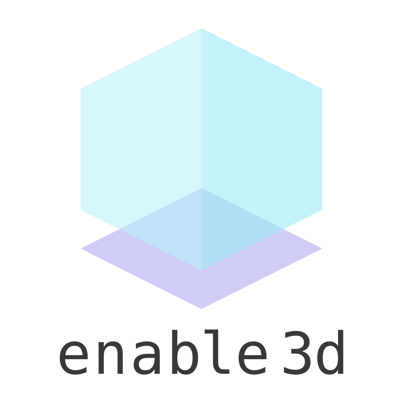

<h1 align="center">
  <a href="https://github.com/yandeu/enable3d#readme"></a>
  <br>
  3D extension for Phaser 3
  <br>
</h1>

<h4 align="center">
Written in TypeScript, uses three.js and ammo.js, brings the third dimension to your Phaser 3 game.</h4>

<p align="center">  
  <a href="https://www.npmjs.com/package/enable3d"></a>
  <a href="https://github.com/yandeu/enable3d/commits/master"></a>
  <a href="https://github.com/prettier/prettier" alt="code style: prettier"></a>
  <a href="https://www.typescriptlang.org/"></a>
</p>

## Install

Install phaser and enable3d via npm:

```console
npm i phaser enable3d
```

## Use

Read more on [github.com](https://github.com/yandeu/enable3d#readme)
